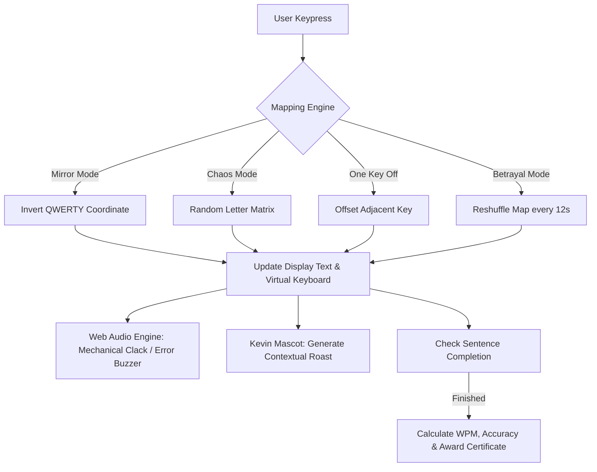

# Inverted Keyboard 🎯

A psychological endurance test disguised as a typing game. Inverted Keyboard hijacks your muscle memory by dynamically mirroring, scrambling, and reversing your keys while an unhinged mascot relentlessly roasts your typing speed.

## Basic Details
### Team Name: Yhwach

### Team Members
- Team Lead: Savin - SNMIMT
- Member 2: Vaisagh - SNMIMT

### Project Description
Inverted Keyboard is an anti-ergonomic typing experience that actively gaslights your fingers. Instead of rewarding your 100 WPM touch-typing skills, it swaps letters across carnival mirrors, randomizes alphabet mappings mid-word, and pairs existential sound effects with emotional degradation.

### The Problem (that doesn't exist)
Modern keyboards are too predictable, too efficient, and dangerously productive. Decades of muscle memory have turned humans into robotic typing machines who never stop to question whether pressing "Q" should really result in a "Q". The thrill of existential confusion while trying to type a simple sentence has been entirely lost to civilization.

### The Solution (that nobody asked for)
We built an interactive, browser-based torture chamber for typists. Inverted Keyboard offers 7+ cursed mapping modes (including Mirror, Alphabet Chaos, One Key Off, and Betrayal Mode where keys secretly reshuffle every 12 seconds), backed by a live Web Audio synthesizer, an overly judgmental mascot named Kevin, and downloadable Certificates of Chaos to honor your shattered patience.

---

## Technical Details

### Technologies/Components Used

#### For Software:
- **Languages:** JavaScript (Modern ES6+ Modules), HTML5, CSS3
- **Frameworks / Bundler:** [Vite](https://vitejs.dev/)
- **Libraries & Web APIs:**
  - **Web Audio API:** Real-time synthesized audio engine (mechanical clicks, error buzzers, existential boings, fanfare)
  - **HTML5 Canvas API:** Procedural generation of personalized "Certificate of Chaos" diplomas
  - **LocalStorage API:** Persistent session tracking, high scores, unlockable achievements, and anti-productivity timers
- **Tools:** VS Code, Git, GitHub

#### For Hardware:
- *N/A (Pure Software Chaos)*

---

### Implementation

#### For Software:

# Installation
```bash
# Clone the repository
git clone https://github.com/savinkrishna12-oss/Inverted_Keyboard.git

# Navigate into the project folder
cd Inverted_Keyboard

# Install dependencies
npm install
```

# Run
```bash
# Start the local development server
npm run dev
```

---

### Project Documentation

#### Gameplay Modes & Features
- 🪞 **Mode 1: Mirror** — Left meets right: `Q` becomes `P`, `W` becomes `O`, and muscle memory collapses.
- 🎲 **Mode 2: Alphabet Chaos** — The keyboard completely forgets standard layout; keys map to random letters.
- 📐 **Mode 3: One Key Off** — Every key outputs its immediate neighbor. You will doubt your spatial awareness.
- 🔄 **Mode 4: Reverse Everything** — Words type completely backwards in real-time.
- 🎭 **Mode 5: Emotional Keyboard** — Special keys develop feelings (`Space` says "NOPE", `Backspace` says "REGRET").
- 🐍 **Mode 6: Betrayal Mode** — Keys silently reshuffle every 12 seconds while typing mid-sentence.
- 👹 **Mode 7: Boss Mode** — Maximum chaos with screen shakes, aggressive scrambles, and high-stakes prompts.
- 📎 **Kevin the Mascot** — A delightfully passive-aggressive companion that comments on every typo.
- 🏆 **Hall of Shame & Achievements** — Tracks your lowest WPMs, longest rages, and rarest catastrophic typos.

# Screenshots

*The main typing arena featuring real-time cursed key translation, dynamic timer, and Kevin the Mascot*


*The Curse Selection Dashboard showcasing 7+ cognitive hazard modes*


*Generative Canvas-powered Certificate awarded after surviving a cursed round*

# Diagrams

*Architecture flow of input interception, curse translation, dynamic feedback, and state management*

---

### Project Demo
# Video
[Add your demo video link here]
*Walkthrough of the cursed typing game, showcasing key swapping modes and the reaction engine in action*

---

## Team Contributions
- **Savin (Team Lead):** Core engine architecture, keyboard mapping algorithms (Mirror, Chaos, Betrayal modes), Web Audio synthesizer engine, and Canvas certificate generator.
- **Vaisagh:** Mascot interaction logic and roast database, theme styling & visual animations, achievements & statistics tracking, and QA testing.

---
Made with ❤️ at TinkerHub Useless Projects 


