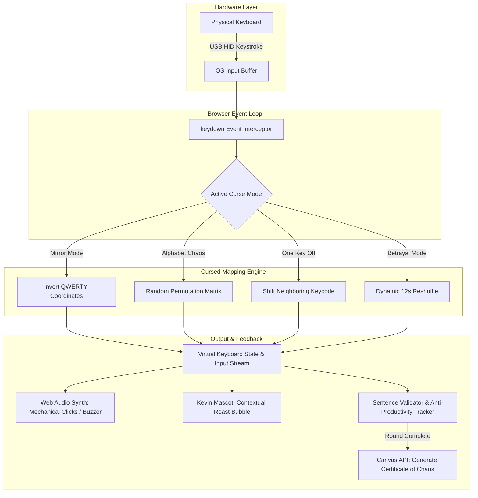

# INVERTED KEYBOARD 🎯

A psychological endurance test disguised as a typing game. Inverted Keyboard hijacks your muscle memory by dynamically mirroring, scrambling, and reversing your keys in real-time while an unhinged mascot relentlessly roasts your typing speed.

## Basic Details
### Team Name: Yhwach

### Team Members
- Team Lead: Savin - SNMIMT
- Member 2: Vaisagh - SNMIMT

### Project Description
Inverted Keyboard is an anti-ergonomic, sanity-draining typing trainer designed to dismantle years of muscle memory. Instead of rewarding high WPM, it actively gaslights the typist by flipping keys across carnival mirrors, offsetting keys to their neighbors, randomizing alphabet mappings mid-sentence, and synthesizing existential sound effects whenever you inevitably fail.

### The Problem (that doesn't exist)
Modern keyboards are too predictable, too efficient, and dangerously productive. Decades of ergonomic design and tactile feedback have turned humans into robotic typing machines who take for granted that pressing "Q" will type "Q". The sheer thrill of existential dread, confusion, and cognitive paralysis while attempting to type a three-letter word has been entirely erased from modern computing.

### The Solution (that nobody asked for)
We built an interactive, browser-based torture chamber for typists. Inverted Keyboard intercepts every hardware keystroke and passes it through an unholy matrix of 7+ cursed mapping modes (including Mirror Mode, Alphabet Chaos, One Key Off, and Betrayal Mode where mappings shuffle every 12 seconds). It features real-time audio synthesized via the Web Audio API, an overly critical companion named Kevin the Mascot, and a generative Canvas-powered Certificate of Chaos to celebrate your defeat.

---

## Technical Details

### Technologies/Components Used

#### For Software:
- **Languages:** JavaScript (Modern ES6+ Modules), HTML5, CSS3
- **Frameworks & Bundlers:** [Vite](https://vitejs.dev/) (Next Generation Frontend Tooling)
- **Libraries & Web APIs:**
  - **Web Audio API:** Real-time modular audio synthesis (mechanical switch clacks, error buzzers, existential boings, victory fanfare)
  - **HTML5 Canvas API:** Procedural generation of exportable high-resolution "Certificates of Chaos" diplomas
  - **LocalStorage API:** Persistent session tracking, custom keybinds, high scores, unlockable achievements, and anti-productivity counters
- **Tools:** Visual Studio Code, Git, GitHub, PowerShell

#### For Hardware:
- **Main Components:**
  - Standard Physical QWERTY Keyboard (Membrane or Mechanical USB/Bluetooth keyboard)
  - Host Computer / Laptop with modern display output (1080p / 720p)
  - Audio Output Device (Speakers / Headphones for live synthesized clicks and roasts)
  - *(Optional Masochist Mod)* Inverted or randomized keycaps physically re-seated on switches
- **Specifications:**
  - Standard 104-Key ANSI / 88-Key ISO Physical Keyboard Layout
  - USB HID 1000Hz polling rate (or standard Bluetooth latency)
  - Stereo Audio Output (44.1 kHz / 48 kHz Web Audio Context)
- **Tools Required:**
  - Modern Web Browser (Chrome, Firefox, Edge, or Brave)
  - Keycap Puller *(Optional: for physically reorganizing keycaps to match the chaos)*
  - Stress Ball *(Recommended: to prevent keyboard destruction)*

---

### Implementation

#### For Software:

# Installation
```bash
# Clone the repository
git clone https://github.com/savinkrishna12-oss/Inverted_Keyboard.git

# Navigate into the project directory
cd inkey

# Install required dependencies
npm install
```

# Run
```bash
# Start the local Vite development server
npm run dev
```

---

### Project Documentation

#### Software Features & Gameplay Modes:
- 🪞 **Mode 1: Mirror** — Left meets right: `Q` becomes `P`, `W` becomes `O`, and muscle memory collapses.
- 🎲 **Mode 2: Alphabet Chaos** — Complete amnesia: every key randomly maps to an unpredictable letter.
- 📐 **Mode 3: One Key Off** — Every key outputs the character directly to its right. You will question your spatial awareness.
- 🔄 **Mode 4: Reverse Everything** — Text prints strictly in reverse order in real-time.
- 🎭 **Mode 5: Emotional Keyboard** — Special keys speak: Space bar shouts "NOPE", Backspace whispers "REGRET", Shift cries "WHY YELL?".
- 🐍 **Mode 6: Betrayal Mode** — Silent sabotage: key mappings reshuffle every 12 seconds mid-sentence.
- 👹 **Mode 7: Boss Mode** — Maximum cognitive hazard: screen shakes, visual glitches, and aggressive scrambles.
- 📎 **Kevin the Mascot** — A passive-aggressive virtual assistant delivering brutal roasts with every typo.
- 📜 **Certificate Generator** — Procedurally drawn certificate of completion with your name, WPM, and shame stats.

# Screenshots

*The main typing arena featuring live inverted text input, interactive virtual keyboard, and Kevin the Mascot*


*The curse selection menu showing all 7 cognitive hazard modes and custom modifiers*


*Generative Canvas-powered diploma commemorating survival through the cursed typing ordeal*

# Diagrams

*System architecture diagram illustrating the pipeline from physical keystroke to cursed translation and multi-sensory feedback.*

---

#### For Hardware:

# Schematic & Circuit
```
+------------------------+      USB HID      +---------------------------+
| Physical QWERTY        | ----------------> | Host Computer / Laptop    |
| Keyboard (104/87 Keys) |   Keystroke Data  | - Vite Dev Server         |
+------------------------+                   | - Browser Runtime (V8)    |
                                             +---------------------------+
                                                           |
                                                           v
+------------------------+   Web Audio API   +---------------------------+
| Stereo Headphones /    | <---------------- | Synthesizer Audio Buffer  |
| External Speakers      |   Mechanical FX   | (Clicks, Buzzes, Fanfare) |
+------------------------+                   +---------------------------+
```
*Hardware signal flow diagram showing raw keystroke capture and synchronized audio response.*

# Build Photos

*Physical setup: Host workstation with mechanical keyboard and audio monitor setup for live gameplay.*

---

### Project Demo
# Video
[Add your demo video link here]
*Demonstration of real-time key remapping, sound synthesis, and roast triggers during an active typing run.*

# Additional Demos
- [Live Web Demo](https://savinkrishna12-oss.github.io/Inverted_Keyboard/) *(GitHub Pages deployment)*

---

## Team Contributions
- **Savin (Team Lead):** Core game architecture, keyboard remapping algorithms (Mirror, Chaos, Betrayal, Boss modes), Web Audio synthesizer engine, HTML5 Canvas certificate generation, and repository setup.
- **Vaisagh:** Mascot interaction design, contextual roast engine & dialogue database, UI themes (Matrix, Cyberpunk, Dark), sound effect tuning, and QA gameplay testing.

---
Made with ❤️ at TinkerHub Useless Projects 


